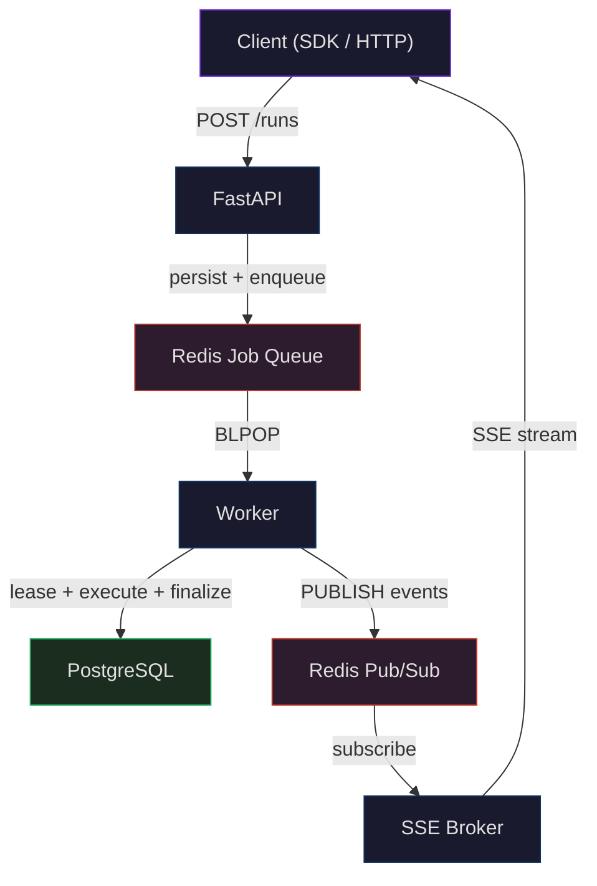
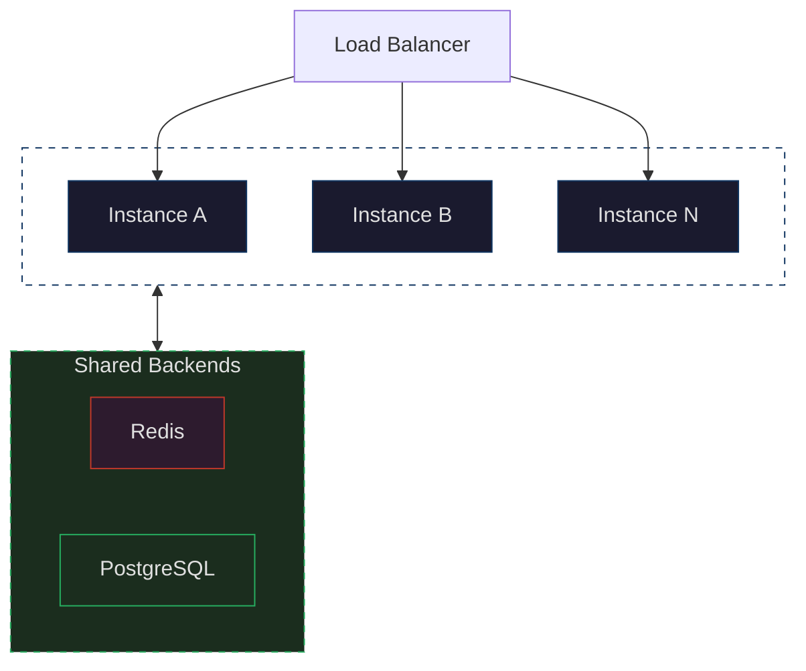
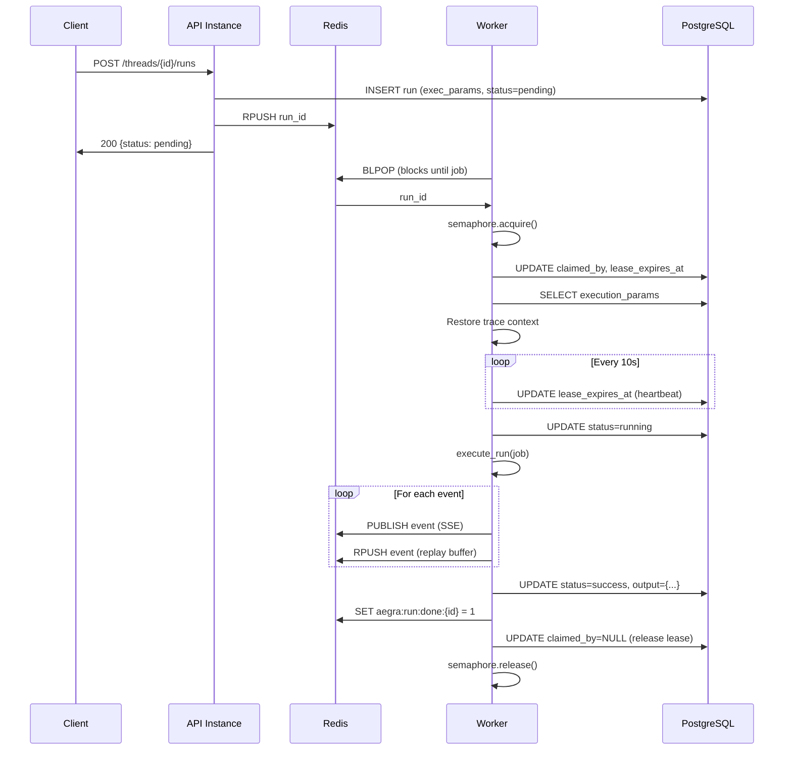
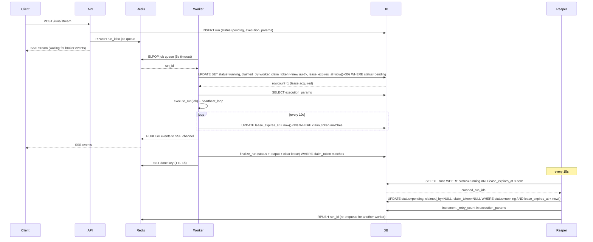
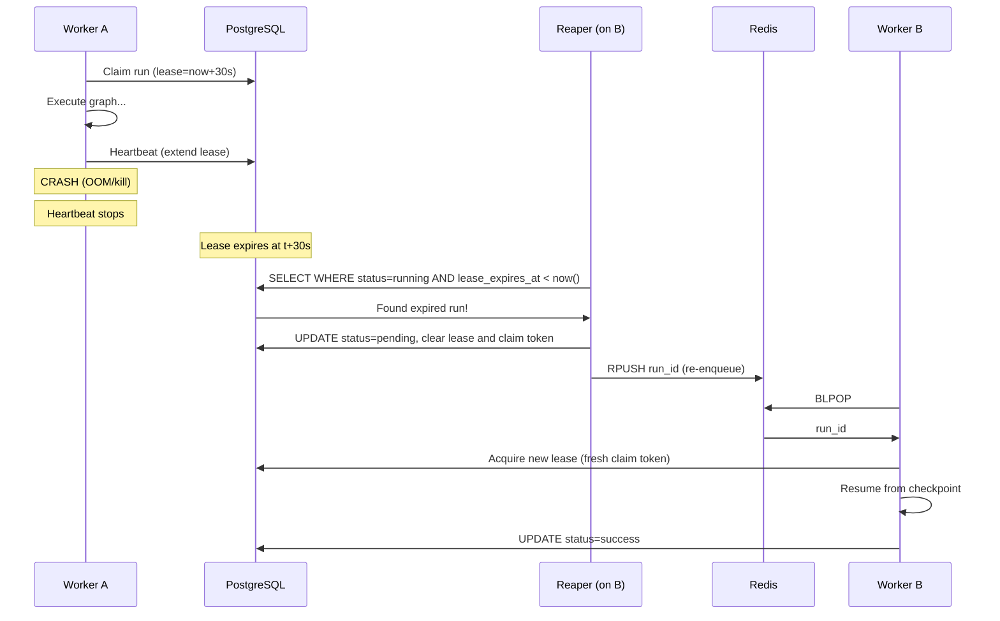
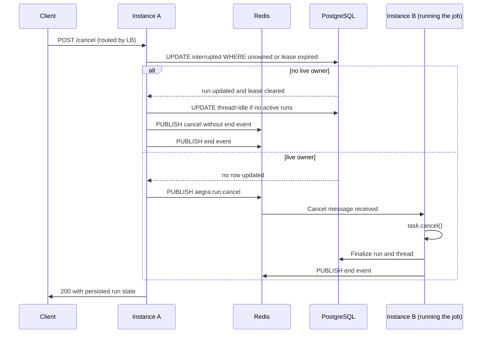

Aegra uses a worker-based execution model for production deployments. Runs are dispatched through a Redis job queue and executed by concurrent asyncio workers across any number of instances. Lease-based crash recovery ensures no run is lost, even if an instance dies mid-execution.

In dev mode (`aegra dev`), none of this is needed — runs execute as simple in-process asyncio tasks.

## Run lifecycle overview

How a single run flows through the system — from client request to completion:

<a href="https://mermaid.live/view#pako:eNqdk1tPwjAUx79KU140QhjDoOzBREQBJaG4GR_Eh3Y7k4ZdtO28Mb673YWxqLywPexc_v-T8-vSNXZjD7CFsB_EH-6SCoWc4SJC-rkKOETqaYGLAB3ZwzvURmPHIccL_FyILslEK26oVDqqqvfgcanr-RfdxgzNE0ig6j_GYgVCC4qgqpORrpFYqhcB9ny6qyfMTlg1UKdtnVftgYiLcbZ9XSZ5r86BWq2LlMxsB7VFEsk027xCyJuvICSXCp0giN6yddOCo4aU6wZTMiNpyVDnybsBUAnZjE9wE5VFPo9owL_1ODL6IycPg-nEHiN41zvqrQrSOnUukwmTruBMDyn5auC5IkOXSgAN05J4yy_VVwDbU_B5EFiNDu1QE5par_1Wo-eZ516_6cZBLKwGGNlb92Yn9K_R8LunPWO_sQQ9yFuyHeQtflZhNb0Oq1ldo9s32X5reeiHeUfbdZl27nzmGYXf6-ImwiGIkHJPX781VksI84voUbHCm80P8HgjAQ==" target="_blank" rel="noopener">View fullscreen ↗</a>

The happy path of a single run, step by step:

1. **Client** sends a run request to any instance via the load balancer.
2. **FastAPI** validates, persists the run to PostgreSQL (with serialized execution params), and pushes the run ID onto the Redis job queue.
3. **Worker** picks up the job via `BLPOP` (blocking pop — instant delivery, no polling).
4. **Worker** acquires an exclusive lease in PostgreSQL, executes the graph, heartbeats every 10s, and finalizes the run (status, output, release lease).
5. **Worker** publishes each event to Redis Pub/Sub for real-time streaming.
6. **SSE Broker** subscribes to Redis Pub/Sub and relays events.
7. **Client** receives events over an SSE connection.

Behind the scenes, the **Lease Reaper** scans PostgreSQL every 15 seconds for runs with expired leases (crashed workers) and re-enqueues them. Workers also send **OpenTelemetry traces** to Langfuse, Phoenix, or any OTLP collector.

## Horizontal scaling

Every instance is stateless — add more instances behind a load balancer to increase capacity. All instances share the same Redis and PostgreSQL backends.

<a href="https://mermaid.live/view#pako:eNqdU1FrwjAQ_itH-qrQ1rmxMgamAxmU0c29rT5cm2jFmkiSMUT870trW9ttOjB5CHfffXff3ZE9ySTjJACyKORXlqMy8P6UCLAnoh8JiSQyoFigyLhKyDwRR1B_pkuF2xyehTYlqG0wVAFQn4n1NChMehDtQrQHhV3opYW4YL9KU8zW1l9WnlnlnLWeXsY3zlZlTPX2kHhq3bHUZqn47DX6q1hEYTh8tPK7Fu1ZYRPbjgIeqqhGTKPb7Ao7CFisiiJwPPTQ5wNtlFzzwHEXo5tbd5DJQqrA4W55uzR6HS28jnbqpKIbhUJv7YSF-ZniaA4ZarsBhbtgDOPzeasV1JJ85qUdSZk7uvfT89R42rSSWuaJ598hvzi4egsX2f93QQZANlxtcMXsb9kTk_NN9W8YqjU5HL4B_SQCkw==" target="_blank" rel="noopener">View fullscreen ↗</a>

Each instance runs multiple worker loops (default 3), and each worker loop handles up to `N_JOBS_PER_WORKER` concurrent runs (default 10) via an asyncio semaphore. Total capacity per instance is `WORKER_COUNT` x `N_JOBS_PER_WORKER` — 30 concurrent runs by default. A job enqueued by Instance A can be picked up by Instance B — any worker can execute any run.

## Job lifecycle

The detailed sequence — every Redis command, database query, and semaphore operation involved in executing a single run:

<a href="https://mermaid.live/view#pako:eNqNU9Fum0AQ_JUVTyC5ttNHJEdKHJpaQgkFW36JhI5jY18Nd-TuiGxZ_vcuhrRQWrW8nMTM3M7O7p0drnJ0fHAMvtUoOT4IttOsfJFAX8W0FVxUTFpYAjOwLARKOwbvolUDN8dKGsvoojEpbigx5sKMsW2DbZU-oB6D0WODRsrYncbkW_giW87y0-0tlfQhek7WMLN7jSw3s7PILzNdy64MMYgXPfqwekqCeA0EgYtH5CkVYaWZADm2tVlUKHMhd15fF_sQR5vka6NKRd6Hlj58ns_h3Kp96OSXD3vbVn4fRs8RuFmh-MFALa0o4LvKuioxkbb-4PZt-8tgyaq90jhl_K0WGl3vF960s4ke7tYB8IKJEvM0O02gQGYwxWNFdJMyOxQkQRgs19C0XluhZNf_oGqMxlJNsJpxBK6kxaP96KhQqoLgHfUJbuad7g-OfncB7h5pnBky27VASfVT6mm7UVAekrIcWGt9Y0qY2wbYc_VFaUDG94DvPze0N4Rocx-uaIpXFNwkCbwRp51zx9BYFewEWf36ivp_XZuaczS0UKq2VW0X5-l0ehksQxKsgSG9MJ-68HMl0W_WFRZw84_hLp42Ydj4uqbbZuz9ZWE6kus5E3BK1CUTOT3ys2P3WF6fe870wblcfgAuaUK2" target="_blank" rel="noopener">View fullscreen ↗</a>

Key details:

1. **Execution params** are stored in PostgreSQL alongside the run, so any worker can reconstruct the full job context (user identity, config, trace metadata, interrupt settings, etc.).
2. **Lease acquisition** is atomic — `UPDATE ... WHERE claimed_by IS NULL` ensures only one worker wins the race. Each acquisition also mints a fresh `claim_token` (see [Claim tokens](#claim-tokens)).
3. **Heartbeats** extend the lease every 10 seconds. If a worker crashes, the lease expires and the run becomes eligible for recovery.
4. **OpenTelemetry trace context** propagates across the Redis queue boundary, so traces span the full request lifecycle.

### Streaming run with crash recovery

The full picture — a streaming run shows how the client SSE connection, worker execution, and reaper recovery all interact:

<a href="https://mermaid.live/view#pako:eNqVVF1r4zAQ_CuLn2za0oajL6YJNI2hhZCa2KEvB0axt40useRK8qW50v9-K8tpE8flOD-Z1X7MzI707uWyQC8ET-NrjSLHCWcvipU_BdBXMWV4zismDNxtOApzGr-NH06Dcyy4Pg0_SbVGdRqfjPtasMrmuhM3_WI0onEhxI9JCpeqFvpSG4V7uHRGGZNxCA-zJJqnQBnga8NMrYcVioKLl3PAN8xrw6XIaBwrdXBY3AAPYR4vkntbnvECjIRfcgmkT41fuZTsQIWQJBE4HOBvGTc0Bp6lgqWSRBfwN2XZMa7YifA1azyNH-OvCeBfazC8RFmbFlqTaAe60rAF1mlneS_iyW0aQRKl0NKmVNHQzjeMmhbZcjfcNiVtKDMEUgxvBG6hrnkxOocNMo0ZvlVcoc6YGQq59YOzH1canu6jeQTHkjock_ERQrnNZS3McAB-0w5Y_lpTvyLogZ1E0-guPdlMJ3Pf26VhRtR8ki2AM1ghOWeJzGQbKStXZ_-s9moHg6u213eCdRnDELqcD8SCkpl8hW1PEqF_sfFiPH0gG7n9WxtZo-QrJgRuOps9tJLL75HpmQu24X8a5ntfE3kySlUb-smJhnJcgn-h7oK1limkQFjjDvw0ncJg9WnZmTQIkqRsb2W41_Va73nY8PE27fU89kvrRbidTU4Vv7GKH1ppPypXTK_IuM70fQPbJXYv-oHjZ4vp9NjvNvK_6PygZzgXucKSNgaZQqN2WeN7Cn9j58_ivqfGV3iBwr0D9gVhQpoVye5ubOCdg1eiKhkv6M1-9-isbF7vgqm19_HxF1iN79E=" target="_blank" rel="noopener">View fullscreen ↗</a>

## Claim tokens

A lease keeps a crashed worker from blocking a run forever, but on its own it does not stop a
*stalled* one. A worker paused past its lease — long GC pause, saturated event loop, unreachable
database — wakes up believing it still owns the run, while the reaper has already handed that run to
somebody else.

`claimed_by` cannot tell those two attempts apart: it is a stable worker name
(`host-pid-worker-idx`), so the same worker re-acquiring the same run reproduces the identity its
abandoned attempt is still writing with. Every acquisition therefore also mints a **`claim_token`**,
a fresh UUID that identifies that attempt and nothing else.

Every ownership-predicated write matches on the token:

| Operation | Predicate |
| --- | --- |
| Heartbeat (extend lease) | `run_id + claim_token` |
| Terminalize (status, output, clear lease) | `run_id + user_id + active status + claim_token` |
| Release leftover lease | `run_id + claim_token + terminal status` |
| Reaper reclaim | clears `claim_token`, retiring the expired attempt |

Two consequences worth knowing:

- **A stalled worker stops itself.** If the heartbeat cannot renew before the lease would expire —
  including when the database is unreachable, since an unrenewed lease expires on its own — the
  worker cancels the graph instead of running on unowned. A single failed renewal with time left on
  the lease is retried, so a brief blip does not abort in-flight runs.
- **Terminalizing clears the lease in the same statement.** A run can never be left terminal while
  still advertising an owner, and a superseded attempt can never strip the lease off its replacement.

Lease expiry is evaluated by PostgreSQL (`now()`), not by the worker or reaper process, so clock
skew between hosts cannot expire a live lease.

## Crash recovery

Every instance runs a `LeaseReaper` background task that scans for runs with expired leases.
When a worker crashes (OOM, kill signal, network partition), its heartbeat stops and the lease expires.
The reaper resets the run to `pending` and re-enqueues it.
The new worker resumes from the last checkpoint.
Once retries are exhausted, the reaper marks the run `error`, clears ownership, and marks the thread `error` in the same transaction when no other run is active.

<a href="https://mermaid.live/view#pako:eNptk19Po0AUxb_KlSfIancT34iaQMu2D12LtIYXk2Z2uLYTygzOH21i_O7eKbiybXkimXN_59wD8x5wVWEQQ2DwxaHkOBFso1nzJIGelmkruGiZtFAmwAyUSteoITk9z6f-PFfGbjQuH-anigJZS7Ok6t9CJSGNzgg7TSXMmRjpIEb6JDtFmVzd3eXTGMY7JhrQTkK4Q2bwVqq3H9e_TDTQlUkM2R65swi0a7sdjUZHmBmS5V9kFkLcW5QVHGjRl9-9oln1ShE8bFwkyxmEi8Wfn7XY7aJzmm-isao1pyBvO_cmgPtWaDRAWuuzf2m71vqEy2yejVdQzrIiIySzztzS2lLIDST3ky7vuketCXUDVEXYZ8unhOl4MfxWjhbspJXv7uKM32M-SVb_nFqqhJwugZOP7syAEYUf-reqxuPQRQxF_kg9kcFaVBBqvEJJP537rrVMO2E6zxd5P-8_WBr3UwOZD5XwF0ehQeJbnyF8pnW3wxjRYMaDCjSuQXjWqgG-RV63Skh7BP5_W-M4R2OCSwga1A0TFd2Y98BusTncnYrpOvj4-AROFg68" target="_blank" rel="noopener">View fullscreen ↗</a>

The reaper runs on every instance (default every 15 seconds). This is safe — the atomic lease acquisition prevents duplicate execution, and claim tokens keep the reaped attempt from writing a result after Worker B takes over.

## Graceful shutdown

On SIGTERM (rolling deploy, pod reschedule, node drain) the executor waits up to `WORKER_DRAIN_TIMEOUT` (default 30s) for in-flight runs to finish. Runs still executing when the window closes are **handed back to the queue**, not finalized: the run is reset to `pending` with its lease cleared and re-enqueued, so another instance resumes it from the last checkpoint — the same guarantee the crash path provides. Clients streaming the run stay connected and pick up events from the resuming worker.

- A user-initiated cancel that races the shutdown still wins: explicitly cancelled runs are finalized as `interrupted`, never resurrected.
- If Redis is unreachable during the hand-off, the rows are already `pending` and unclaimed, so a surviving instance's reaper re-enqueues them after `STUCK_PENDING_THRESHOLD_SECONDS`.
- Drain hand-offs do not consume the crash retry budget (`BG_JOB_MAX_RETRIES`).

Set your orchestrator's grace period a few seconds above `WORKER_DRAIN_TIMEOUT` (on Kubernetes: `terminationGracePeriodSeconds`), so the requeue completes before the pod is killed. Runs longer than the drain window survive the deploy either way; the timeout only decides how long the old pod waits before handing them off.

## Cross-instance cancellation

Cancel requests can arrive at any instance, but the run may be executing on a different one.
The API first tries an ownership-safe database update that succeeds only when the run is active and has no owner or an expired lease.
That path interrupts the run, clears its lease, and marks the thread idle in one transaction when no other run is active.
The API still broadcasts a best-effort cancellation after this transaction because an expired worker may be delayed rather than dead.
It emits the terminal stream event itself so connected clients always receive a definitive end event.
When the run has a live owner, the API leaves the database state unchanged and uses Redis pub/sub to ask that worker to cancel its task and finalize the run.
Requests for runs that are already terminal are no-ops, so a late cancellation cannot overwrite a successful or failed result.
Worker finalization is also conditional on the run remaining active, which prevents a delayed worker from overwriting a terminal state committed by the API.
The response contains the currently persisted state; set `wait=1` to wait for a live worker to finalize the run before returning.

## Dev vs production mode

| | Dev (`aegra dev`) | Production (`aegra up` / `aegra serve`) |
|---|---|---|
| Executor | `LocalExecutor` — `asyncio.create_task()` | `WorkerExecutor` — BLPOP + semaphore + lease |
| Redis required | No | Yes |
| Crash recovery | No (single process) | Yes (lease reaper) |
| Cross-instance cancel | N/A | Yes (Redis pub/sub) |
| SSE broker | In-memory queue + list | Redis pub/sub + replay buffer |
| Scaling | Single instance | Horizontal (shared Redis + PostgreSQL) |

<Tip>
  `aegra dev` is designed for fast iteration — no Redis, no workers, no leases. Just start coding and your runs execute immediately in-process.
</Tip>

## Redis data layout

| Key | Purpose | Written by | Read by |
|:----|:--------|:-----------|:--------|
| `aegra:jobs` | Job queue (BLPOP) | API (RPUSH) | Worker (BLPOP) |
| `aegra:run:{run_id}` | SSE live events | Worker (PUBLISH) | API (SUBSCRIBE) |
| `aegra:run:cache:{run_id}` | SSE replay buffer | Worker (RPUSH) | API (LRANGE) |
| `aegra:run:counter:{run_id}` | Event sequence counter | Worker (INCR) | API (GET) |
| `aegra:run:cancel` | Cancel commands | API (PUBLISH) | Worker (SUBSCRIBE) |
| `aegra:run:done:{run_id}` | Completion signal (TTL 1h) | Worker (SET) | API (EXISTS) |

## Configuration

All worker settings are configured via environment variables. See the [environment variables reference](/reference/environment-variables) for the full list.

| Variable | Default | Description |
|:---------|:--------|:------------|
| `REDIS_BROKER_ENABLED` | `false` | Enable Redis workers and broker |
| `REDIS_URL` | `redis://localhost:6379/0` | Redis connection URL |
| `WORKER_COUNT` | `3` | Worker loops per instance |
| `N_JOBS_PER_WORKER` | `10` | Concurrent runs per worker loop |
| `BG_JOB_TIMEOUT_SECS` | `3600` | Max execution time per run (1 hour) |
| `BG_JOB_MAX_RETRIES` | `3` | Max retry attempts before a crashed run is permanently failed |
| `STUCK_PENDING_THRESHOLD_SECONDS` | `120` | How long a pending run can sit before the reaper re-enqueues it |
| `LEASE_DURATION_SECONDS` | `30` | Lease TTL before reaper reclaims |
| `HEARTBEAT_INTERVAL_SECONDS` | `10` | Lease extension frequency |
| `REAPER_INTERVAL_SECONDS` | `15` | Expired lease scan frequency |
| `POSTGRES_POLL_INTERVAL_SECONDS` | `5` | Fallback poll interval when Redis is unavailable |
| `WORKER_DRAIN_TIMEOUT` | `30.0` | Graceful shutdown wait (seconds) before in-flight runs are requeued for another instance |

<Note>
  When Redis is unavailable, workers fall back to polling PostgreSQL for pending runs at `POSTGRES_POLL_INTERVAL_SECONDS` intervals. This keeps the system functional during Redis outages, though with higher latency.
</Note>

## File map

| File | Purpose |
|:-----|:--------|
| `services/executor.py` | Factory — selects `LocalExecutor` or `WorkerExecutor` |
| `services/base_executor.py` | Abstract interface: submit, wait, start, stop |
| `services/local_executor.py` | Dev mode: `asyncio.create_task` |
| `services/worker_executor.py` | Production mode: BLPOP + semaphore + lease + heartbeat |
| `services/run_executor.py` | Shared execution logic (used by both executors) |
| `services/run_status.py` | Database status updates |
| `services/run_preparation.py` | Run creation (validate, persist, submit) |
| `services/lease_reaper.py` | Background task recovering crashed worker runs |
| `services/broker.py` | In-memory broker + factory |
| `services/redis_broker.py` | Redis pub/sub broker for SSE |
| `services/streaming_service.py` | SSE orchestration (replay + live) |
| `models/run_job.py` | `RunJob` Pydantic model (serialized execution params) |
| `core/orm.py` | Run table with `execution_params`, `claimed_by`, `lease_expires_at` |
| `core/active_runs.py` | In-memory task registry (dev mode only) |
| `core/redis_manager.py` | Redis connection pool singleton |
